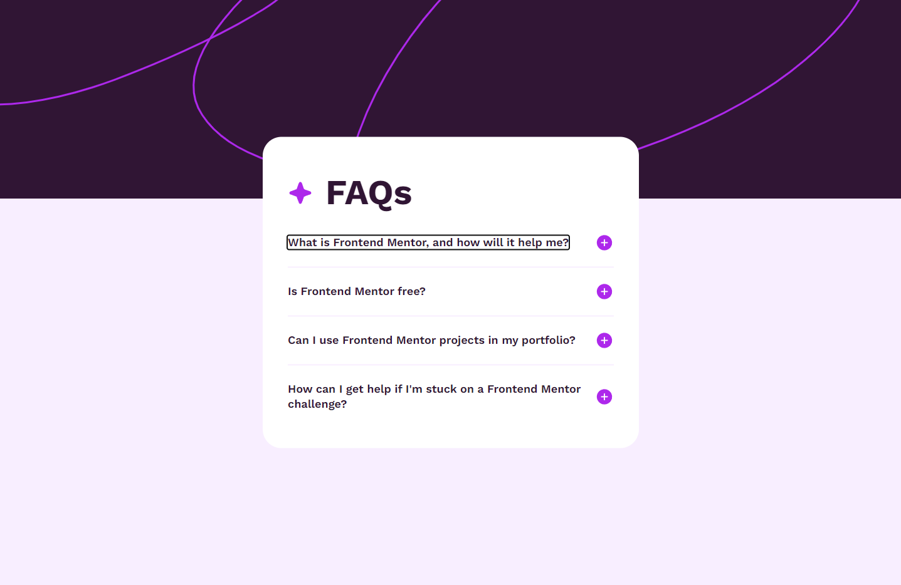

# Frontend Mentor - FAQ accordion solution

This is a solution to the [FAQ accordion challenge on Frontend Mentor](https://www.frontendmentor.io/challenges/faq-accordion-wyfFdeBwBz). Frontend Mentor challenges help you improve your coding skills by building realistic projects. 

## Table of contents

- [Overview](#overview)
  - [The challenge](#the-challenge)
  - [Screenshot](#screenshot)
  - [Links](#links)
- [My process](#my-process)
  - [Built with](#built-with)
  - [What I learned](#what-i-learned)
  - [Continued development](#continued-development)
  - [Useful resources](#useful-resources)
- [Author](#author)
- [Acknowledgments](#acknowledgments)

## Overview

### The challenge

Users should be able to:

- Hide/Show the answer to a question when the question is clicked
- Navigate the questions and hide/show answers using keyboard navigation alone
- View the optimal layout for the interface depending on their device's screen size
- See hover and focus states for all interactive elements on the page

### Screenshot

### Links

- Solution URL: [Add solution URL here]()

## My process

started with arranging the html element to contain the appropriate content and focussed on styling the elements from top to bottom.finally tested and added the script to  toggle hide/show the answer content with event handling.

### Built with

- Semantic HTML5 markup
- CSS custom properties
- Flexbox
- Javascript

### What I learned

I  learnt that if something doest work right in script,its a good idea to try it with an sample trial and error method andd once you are sure of how the script handles the element proceed with the desired function on it.

### Continued development

I want to focus more how to integrate js into the dom with ease and functionality.

### Useful resources

- [Example resource 1](https://www.w3schools.com/jsref/jsref_foreach.asp) - this linked helped to provide an easy solution to apply eventlistener function on multiple nodes at once.

## Author

- Website - [Mnaoj Baskar](https://www.linkedin.com/in/manoj-baskar-42a734159/)
- Frontend Mentor - [@manojaba](https://www.frontendmentor.io/profile/manojaba)
- Twitter - [@manojaba](https://github.com/manojaba)

## Acknowledgments

I went through jsDawg1's solution to understand where i was stuck. I really appreciate hiseffirt to post the solution.

